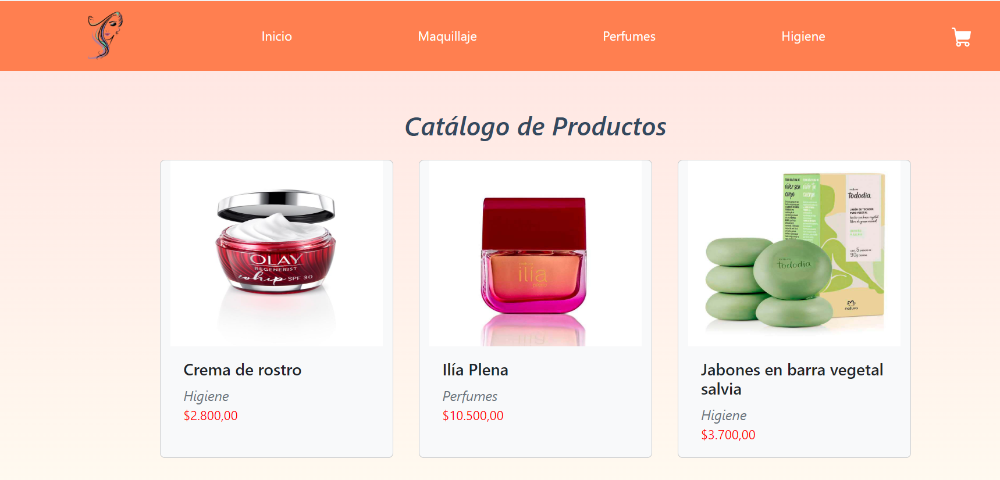
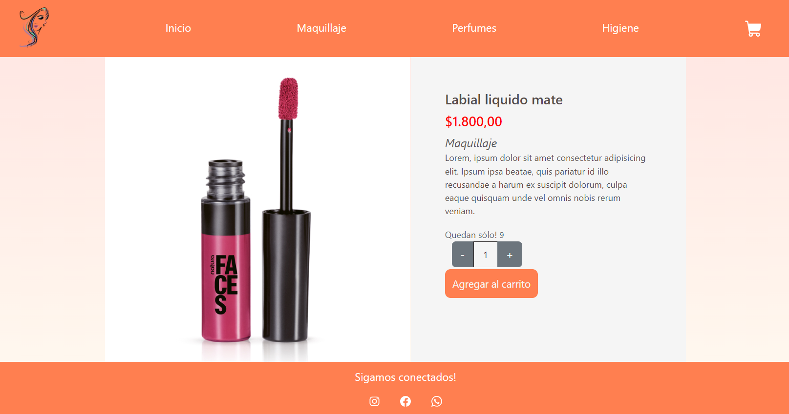
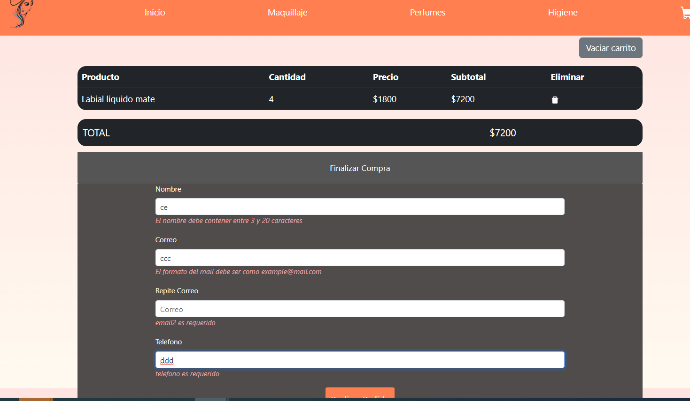

<!-- Improved compatibility of back to top link: See: https://github.com/othneildrew/Best-README-Template/pull/73 -->
<a name="readme-top"></a>


<!-- PROJECT LOGO -->
<br />
<div align="center">
  <a href="https://github.com/othneildrew/Best-README-Template">
    
  </a>

  <h3 align="center">Mi E-commerce Natura</h3>

  <p align="center">
   Una App de productos de bellezas para ellas
    <br />
  </p>
</div>

<!-- TABLE OF CONTENTS -->

## Tabla de Contenidos
1. [Acerca de mi proyecto](#acerca-de-mi-proyecto)
2. [Imagenes](#imagenes-de-la-página-de-e-commerce)
2. [Tecnologías](#tecnologies)
3. [Instalación](#instalacion)
4. [Colaboración](#colaboración)
5. [Contacto](#contacto)
5. [FAQs](#faqs)


### Acerca de mi Proyecto
***
Esta APP es una página de e-commerce de productos de belleza diseñada para vender todo los relacionado a la belleza femenina. Es un negocio familiar.
Está desarrollada integramente en React, donde se utilizó en el desarrollo NodeJS para la ejecución de paquetes por línea de comando.
React soportado por Vite, cuenta con las actualizaciones requeridas en el desarrollo de paginas, para hacer que lo empleado en el desarrollo, sea lo último disponible.

### Imagenes de la página de e-commerce





## Tecnologies
***
Listado de tecnologias usadas en el proyecto:
* NodeJS: (https://nodejs.org/es) Version 20.1.0 
* Boostrap: (https://getbootstrap.com/) Version 5.3.1.
* Vite: (https://vitejs.dev/)


## Instalacion
***
Pasos para la instalacion del proyecto. 
```
$ git clone https://github.com/celevocos/BellezaNatura.git
$ cd productos
$ npm install
$ npm run dev
```

## Colaboración
***
Con la colaboracion de CODERHOUSE y Claro Argentina, se logró el desarrollo y diseño de la Ecommerce.


<!-- CONTACT -->
## Contacto

Celeste Vocos  - celestevocos@hotmail.com

Link del proyecto: [https://github.com/your_username/repo_name](https://github.com/celevocos/BellezaNatura.git)


## FAQs
***
1. **Que se puede comprar?**
 Hay disponibles productos de belleza para la mujer
2. **Es intuitiva la navegacion?**
La página es intuitiva y fácil de concretar la compra.
3. **Es facil la instalacion del proyecto?**
 Si, sigue los pasos en Instalacion.


